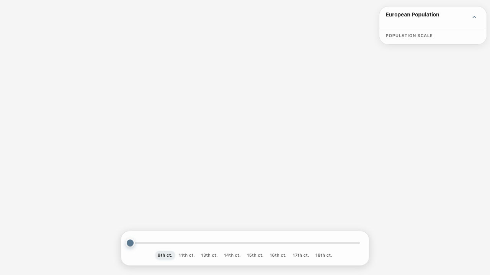

# HiSMaComp

[](https://github.com/a-a-m-k/HiSMaComp/actions/workflows/ci.yml)

**Hi**storical **S**ettlement **Ma**p **Comp**arison — an interactive map of European town populations from 800 to 1750. Pick a century on the timeline; markers are sized by European population and the map zooms to keep the data in view.

**Live:** https://a-a-m-k.github.io/HiSMaComp/



## What’s in it

- **Map:** MapLibre GL + React Map GL, Stadia terrain tiles, custom zoom-to-fit and pan limits.
- **UI:** React 18, TypeScript, Vite, MUI v6. Timeline, legend, screenshot export, PWA with a small service worker (cache-first for hashed assets).
- **Quality:** Error boundaries, keyboard/screen-reader support, Vitest + Playwright, ESLint/Prettier, GitHub Actions for CI and deploy.

## Tech stack

React 18, TypeScript, Vite · MapLibre GL JS, React Map GL · MUI v6 · Vitest, React Testing Library, Playwright · ESLint, Prettier, Husky · GitHub Actions (CI + GitHub Pages).

## Project structure

```
src/
├── components/   # React components (controls, map, ui, dev tools)
├── context/      # App state (year, towns, loading, error)
├── hooks/        # Custom hooks (map view, resize, keyboard, etc.)
├── services/     # YearDataService with LRU cache
├── utils/        # Zoom (Mercator), GeoJSON, markers, theme
├── constants/    # Config, breakpoints, legend LCP
└── theme/        # MUI theme
```

## Architecture notes

- **Data flow:** raw towns are loaded in `useTownsData`, year-scoped results are derived in `useYearDataController`, and shared through `AppContext` (`selectedYear`, `filteredTowns`, loading/error state).
- **Map rendering split:** `MapView` coordinates camera/state, `MapCanvasStack` owns MapLibre canvases/layers, and marker/label behavior lives under `MapView/TownMarkers`.
- **Derived-data caching:** `YearDataService` uses LRU caches and stable cache keys so timeline scrubbing avoids repeated heavy computations.
- **Error handling policy:** user-facing messages and error reporting are centralized in `src/utils/errorPolicy.ts`, with accessibility announcements for actionable failures.
- **Observability:** optional Sentry bootstrap lives in `src/instrument.ts`; lightweight telemetry timings/events are emitted from key flows (data load, year switch, screenshot).

## Design decisions (deep dive)

- **Year-scoped data and the timeline:** Scrubbing centuries recomputes filtered towns, geographic bounds, centers, and GeoJSON. That work is centralized in `YearDataService` with **LRU caches** and a **stable cache key** derived from the towns payload and year, so repeated visits to the same year and common scrub patterns stay cheap without unbounded memory.
- **Zoom-to-fit in Web Mercator:** Fitting the camera to data cannot rely on naive latitude span at high latitudes. `getZoomToFitBounds` in `src/utils/mapZoom.ts` converts latitudes through a **Mercator y-transform**, then derives separate zoom candidates for latitude and longitude; the **minimum** of those becomes the limiting axis so the full bounds stay in view. `calculateMapArea` subtracts legend and timeline chrome so “fit” uses the **actual map viewport**, not the full window.
- **Context vs map props:** `AppContext` intentionally holds **data and year selection only**. Initial camera and resize-driven refits live beside the map so viewport changes do not force unrelated UI to re-render through context.

## Quick start

**Prereqs:** Node 20+, npm, and a [Stadia Maps API key](https://client.stadiamaps.com/). For E2E tests, run `npm run test:e2e:install` once to install Playwright browsers.

```bash
git clone https://github.com/a-a-m-k/HiSMaComp.git
cd HiSMaComp
npm install
cp .env.example .env
```

In `.env` set `VITE_STADIA_API_KEY=your-key`. Then:

```bash
npm run dev
```

Open http://localhost:5173

| Env var                                   | Required | Description                               |
| ----------------------------------------- | -------- | ----------------------------------------- |
| `VITE_STADIA_API_KEY`                     | Yes      | Stadia Maps key for tiles                 |
| `VITE_BASE_PATH`                          | No       | e.g. `/HiSMaComp/` for GH Pages           |
| `VITE_SENTRY_DSN`                         | No       | Sentry frontend DSN                       |
| `VITE_APP_RELEASE`                        | No       | Release label (commit/tag)                |
| `VITE_SENTRY_TRACES_SAMPLE_RATE`          | No       | Trace sample rate (0.0-1.0, default 0.1)  |
| `VITE_SENTRY_REPLAY_SESSION_SAMPLE_RATE`  | No       | Replay session sample rate (default 0.1)  |
| `VITE_SENTRY_REPLAY_ON_ERROR_SAMPLE_RATE` | No       | Replay-on-error sample rate (default 1.0) |

**Key restriction:** In the [Stadia Maps dashboard](https://client.stadiamaps.com/), restrict the API key by HTTP referrer or domain (e.g. `https://a-a-m-k.github.io/*` for GitHub Pages and `http://localhost:*` for local dev) so the key cannot be used from other origins.

## Scripts

| Command                    | Description                                                    |
| -------------------------- | -------------------------------------------------------------- |
| `npm run dev`              | Dev server                                                     |
| `npm run build`            | Production build                                               |
| `npm run test:run`         | Run tests                                                      |
| `npm run test:coverage`    | Tests + coverage                                               |
| `npm run test:e2e`         | Playwright E2E                                                 |
| `npm run test:e2e:install` | Install Playwright browsers (run once before first `test:e2e`) |
| `npm run lint`             | Lint                                                           |
| `npm run deploy`           | Deploy to GitHub Pages                                         |

## Quality targets

- Coverage gates are enforced in `vitest.config.ts` to maintain a baseline signal:
  - Statements: `>=50%`
  - Branches: `>=45%`
  - Functions: `>=50%`
  - Lines: `>=50%`
- Goal: keep a realistic floor for a small portfolio app while prioritizing behavior-driven tests in high-impact flows (map interactions, year filtering, and error handling).

### Critical flows protected

| Flow                                          | Unit tests                                                                                     | E2E tests                                                                       |
| --------------------------------------------- | ---------------------------------------------------------------------------------------------- | ------------------------------------------------------------------------------- |
| Timeline year change updates filtered data    | `tests/unit/context/useYearDataController.test.tsx`, `tests/unit/components/Timeline.test.tsx` | `tests/e2e/boundary-years.spec.ts`                                              |
| Map marker interaction (focus/click/keyboard) | `tests/unit/components/TownMarkerItem.test.tsx`, `tests/unit/components/TownMarkers.test.tsx`  | `tests/e2e/resize-map.spec.ts` (map remains interactive through layout changes) |
| Error fallback and recovery UI                | `tests/unit/components/ErrorBoundary.test.tsx`, `tests/unit/utils/errorPolicy.test.ts`         | `tests/e2e/error-boundary.spec.ts`                                              |
| Screenshot capture + failure handling         | `tests/unit/hooks/useScreenshot.test.ts`                                                       | Covered by interaction smoke checks in deploy checklist                         |
| Accessibility baseline                        | Component-level assertions in unit tests                                                       | `tests/e2e/accessibility.spec.ts` (`axe-core`)                                  |

**E2E lanes:** `npm run test:e2e` runs gating behavior suites; `npm run test:visual` runs non-gating visual capture specs (`@visual` tagged).

## Deploy (GitHub Pages)

**Enable deployment:** In the repo go to **Settings → Pages**. Under **Build and deployment**, set **Source** to **GitHub Actions**. Until this is set, the workflow’s deploy job will not publish the site.

Set `VITE_STADIA_API_KEY` as a repo secret; push to `main` runs the workflow and deploys. Restrict the key by domain in the Stadia dashboard (e.g. to your GitHub Pages origin) so it is not usable from other sites.

Required secret:

```bash
gh secret set VITE_STADIA_API_KEY --repo a-a-m-k/HiSMaComp
```

Optional Sentry secrets (only if you want observability in Sentry):

```bash
gh secret set VITE_SENTRY_DSN --repo a-a-m-k/HiSMaComp
gh secret set VITE_APP_RELEASE --repo a-a-m-k/HiSMaComp
gh secret set VITE_SENTRY_TRACES_SAMPLE_RATE --repo a-a-m-k/HiSMaComp
gh secret set VITE_SENTRY_REPLAY_SESSION_SAMPLE_RATE --repo a-a-m-k/HiSMaComp
gh secret set VITE_SENTRY_REPLAY_ON_ERROR_SAMPLE_RATE --repo a-a-m-k/HiSMaComp
```

Optional source-map upload secrets (for readable production stack traces):

```bash
gh secret set SENTRY_AUTH_TOKEN --repo a-a-m-k/HiSMaComp
gh secret set SENTRY_ORG --repo a-a-m-k/HiSMaComp
gh secret set SENTRY_PROJECT --repo a-a-m-k/HiSMaComp
```

### Production observability

- Sentry is initialized in `src/instrument.ts` (imported first in `main.tsx`) and only enabled when `VITE_SENTRY_DSN` is present (safe for GitHub Pages static hosting).
- App errors from `errorPolicy` are reported to Sentry with structured context (`category`, `operation`, `year`).
- Core Sentry features enabled: Error Monitoring, Browser Tracing, and Session Replay.
- Lightweight telemetry events/timings are emitted for:
  - `towns_data_load_ms`
  - `year_change_compute_ms`
  - `screenshot_capture_ms`
  - retry/failure events for key user actions

### Sentry quick setup (optional)

Sentry is optional. If you do nothing, the app still builds/deploys normally and Sentry stays disabled.

Minimum setup:

1. Create a Sentry JavaScript/React project and copy the DSN.
2. Add one GitHub secret:
   - `VITE_SENTRY_DSN` = `<your DSN>` (paste raw value, no quotes/brackets).
3. Push to `main` (or rerun workflow) to trigger a fresh build.
4. Open the deployed site and run a one-time test in browser console:

```js
throw new Error("Sentry production smoke test");
```

5. Confirm the event appears in Sentry **Issues**.

Optional tuning secrets (defaults are already in workflow):

- `VITE_SENTRY_TRACES_SAMPLE_RATE` (default `0.1`)
- `VITE_SENTRY_REPLAY_SESSION_SAMPLE_RATE` (default `0.1`)
- `VITE_SENTRY_REPLAY_ON_ERROR_SAMPLE_RATE` (default `1.0`)
- `VITE_APP_RELEASE` (default `github.sha`)

Recommended pet-project defaults:

- `VITE_SENTRY_TRACES_SAMPLE_RATE=0.1`
- `VITE_SENTRY_REPLAY_SESSION_SAMPLE_RATE=0.05` (or `0.1`)
- `VITE_SENTRY_REPLAY_ON_ERROR_SAMPLE_RATE=1.0`

### Post-deploy observability checklist

After each deploy to GitHub Pages:

1. Open **Actions** and confirm `CI and Deploy` passed.
2. Visit the live site and perform 2-3 real interactions (change year, save screenshot, pan/zoom).
3. In Sentry, verify:
   - **Issues** contains any new captured errors (if triggered)
   - **Performance** shows browser traces
   - **Replays** shows recent sampled sessions
4. If no events appear, run a one-time browser-console test on production:

```js
throw new Error("Sentry production smoke test");
```

5. Confirm the test error appears in Sentry, then continue normal usage.

## License and attribution

Application source is licensed under the [MIT License](LICENSE).

Map data and tiles: Stadia Maps, Stamen Design, OpenMapTiles, OpenStreetMap.

See [CONTRIBUTING.md](CONTRIBUTING.md) for how to run the same checks as CI locally.
